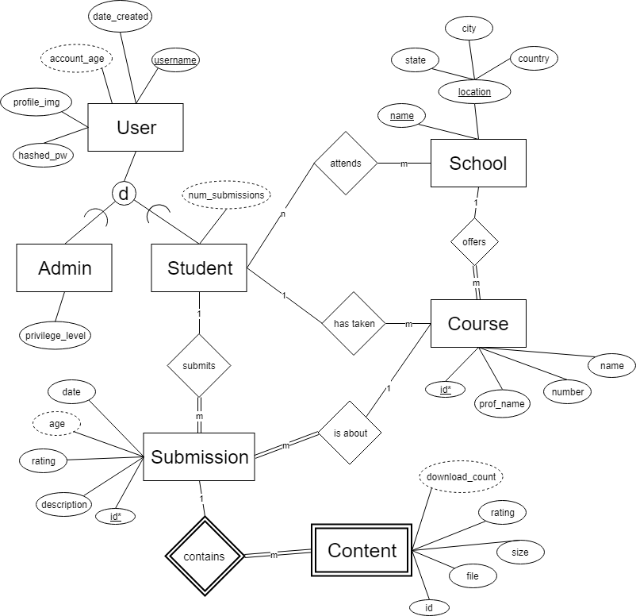

# Course Project - Phase 1: Conceptual Database Design

CS 2300-1A
Cole Dieckhaus, Sierra Madrid, Thomas McKanna

CourseBin

##Problem statement

It can be frustrating to get stuck on a homework assignment when there are no 
relevant resources to help you. By the time a student completes a course, they 
have often accumulated a group of files (practice exams, completed homework 
assignments, study materials, etc.) which end up sitting unused on their computer. 
These files could be useful study materials to other students.

Our project idea is to create a database-driven website of course content
collected by students. Users can search for materials shared by other students, 
or upload content of their own. Submissions can be rated by other users so that the 
best stand out. This will provide a convenient way to access numerous study 
resources tailored to specific courses.

## Functional Requirements

Search and retrieve for content based on course name or school.
* Involves Student, School, and Submission tables
* Option to sort results by popularity or upload date

Add an account
* Involves Student or Admin table

User submits content to be uploaded
* Involves Student, School, Course, and Submission tables
