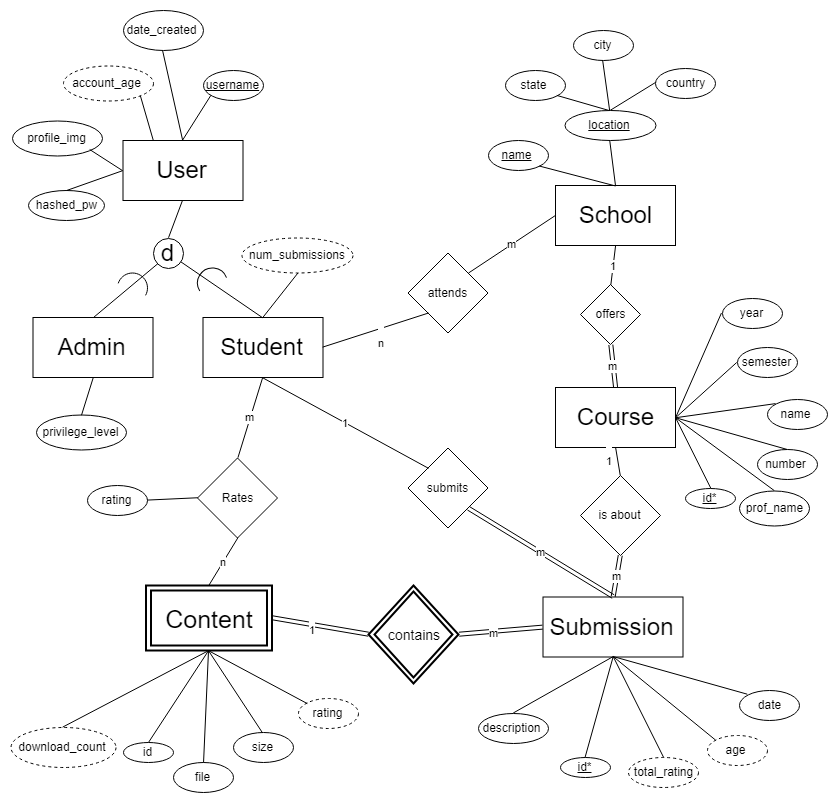

CS 2300-1A

Cole Dieckhaus, Sierra Madrid, Thomas McKanna

# Course Project - Phase 1: Conceptual Database Design

## Resources

[Official  React Tutorial 1-12](https://reactjs.org/docs/hello-world.html)

[Express Introduction (Routing/Writing Middleware/Using Middleware](https://expressjs.com/en/guide/routing.html)

[Building REST API with Express](https://www.robinwieruch.de/node-express-server-rest-api/)

[Authenticating usering using JSON web tokens](https://scotch.io/tutorials/authenticate-a-node-js-api-with-json-web-tokens)

## Roadmap

1. Convert ER diagram to set of relations 
2. Create pseudocode for all the major functions of our application
3. Create MySQL schema creation script
4. Write out the structure of the SQL queries that will be used
5. Implement Express API for executing the queries of step 4.
6. Implement React frontend.

## Problem statement

It can be frustrating to get stuck on a homework assignment when there are no 
relevant resources to help you. By the time a student completes a course they 
have often accumulated a group of files (practice exams, completed homework 
assignments, study materials, etc.), which end up sitting unused on their computer. 
These files could be useful study materials to other students.

Our project idea is to create a database-driven website of course content
collected by students. Users can search for materials shared by other students 
and upload content of their own. Submissions can be rated by other users so that the 
best stand out. This will provide a convenient way to access numerous study 
resources tailored to specific courses.

## EER Diagram

The following assumptions have been made with regard to the above diagram:

* A student does not need to have attended a school, taken any courses, or made any submissions to make an account.
* Each course must be associated with a particular school.
* Two courses that are about the same subject but are taught by different schools are considered different courses.
* A submission must be associated with a particular course and a particular student.
* A submission must have at least one piece of content (an uploaded file) associated with it.

## Functional Requirements

### Search for courses
* Find submissions based on a user's search criteria, with the option of ordering the results by rating or date. Will use the tables *courses*, *schools*, and *students*.
* Inputs: course id, school id, user name (each of these is optional)

Steps:
1. User fills out form and submits it.
2. Form contents are used to generate query which checks if there are any courses which meet the search criteria (this will involve joining, *courses*, *schools*, and *students* and applying a conditional)
3. Results are returned to the user via a JSON object.
4. The JSON object is parsed and used to generate the list of courses displayed on the user's screen.

### Get submissions
* Given a course id, retrieves the submissions associated with the course. Will use the tables *courses* and *submissions*.
Inputs: course id (note: course id refers to a specific combination of course, school, and semester)

Steps:
1. User either clicks on a course listed in search results or directly types URL.
2. A query is made which retrieves all submissions associated with a particular course.
3. Results are returned to the user via a JSON object; this object contains submission ids.
4. The JSON object is parsed and displayed as clickable buttons on the screen;

### Get content
* Given a submission id, retrieves the content associated with the submissions. Will use the tables *submissions* and *content*.
* Inputs: submission id

Steps:
1. User either clicks on a submission listed in search results or directly types URL.
2. A query is made which retrieves all content associated with a particular submission.
3. Results are returned to the user via a JSON object; this object contains URLs of the content items.
4. The JSON object is parsed and displayed as clickable buttons on the screen; clicking one of the buttons triggers it being downloaded.

### Rate content
* The user rates the content (rating system not yet determined). Will use the tables *students*, *ratings*, and *content*.
Input: content id, rating (rating could be upvote/downvote, or 1-5 stars)

Steps:
1. While on a page displaying the content associated with a particular submission, the user clicks the rating button.
2. The rating and the associated content are combined and inserted into the database.
3. The rating is immediately updated on the client side (superficially); reloading the page retrieves the actual new rating.

### Add course
* If, while creating a submission, the course associated with the submission is not yet in the database, it is added with this function. Will use the *courses* and *schools* tables.
Inputs: school id, course name, year, semester, professor name

Steps:
1. The user clicks the "make a submission" button on the home page, redirecting them to a form.
2. The user fills out the form, entering a school, course name, professor, year, semester, and professor name, and then submits the form.
3. The contents of the form are queried to ensure an exactly matching course does not already exist. If the course does exist, the user is re-routing to the courses URL, where the user can click a button for creating a submission. If the course does not exist, the contents of the form are used into insert the course into the database.
4. The user is redirected to the new course URL.

### Add submission
* Allows the user to add a submission that is associated with a particular course. Will use the *courses*, *students*, and *content* tables.
Inputs: course id, description, a series of one or more file uploads.

Steps:
1. The user clicks on the "add submission" button on any course's URL.
2. The user is redirected to a form which has a field for description, as well as button which, when clicked, open up a file explorer for the user to choose a file from. Upon selecting a file, another, separate, button is created, allowing for multiple files to be uploaded.
3. The user submits the form; basic checks limiting the size of files being uploaded are performed.
4. The files are uploaded and put it the proper folder on the backend, and the submission is added to the database.

### Delete submission (user control panel)
* Allows a user to delete their own submissions. Will use the *courses*, *students*, and *content* tables.
Inputs: submission id.

Steps:
1. The user navigates to their personal panel, which lists all the submissions they have made.
2. The user clicks on the "delete submission" button associated with the submission they want to be deleted.
3. The submission id is used to delete the submission from the database, and cascade the delete such that it removes all content associated with the submission, and removes the submission from the associated course.

### Modify submission (user control panel)
* Allows a user to modify their own submissions. Will use the *courses*, *students*, and *content* tables.
Inputs: submission id.

Steps:
1. The user navigates to their personal panel, which lists all the submissions they have made.
2. The user clicks on the "modify submission" button associated with the submission they want to be deleted.
3. The submission id is used to retrieve the content and description associated with the submission. This information is reconstructed into a similar format as when the submission was created.
4. On this page, the user can click on the "remove file" button next to any given existing content item, or the "add file" button to add a new file. The description is also editable.
5. Submitting the form causes the submission to be updated in the database.

### Add user
* Create a new account for a user, allowing them to create submissions and rate content. Will use the *students* table.
Inputs: username, password.

Steps:
1. User navigates to the login page either by clicking the "create account" button on the homepage, or by being redirect after attempting to access features only available to users.
2. User inputs their desired username and password in the form and submits it.
3. The password is combined with a random salt and has its hash taken.
4. The username, hash, and salt are stored in the database.
5. An authentication token is sent to the user.

### Log in
* The user logs in, allowing them to create submissions and rate content. Will use the *students* table.
Inputs: username, password.

Steps:
1. User click on the "log in" button on the homepage.
2. User enters username and password and submits form.
3. The password is combined with the salt associated with the username (if the username does not exist, return error) and hashed.
4. The hash is compared with the hash in the database (if not the same, return error).
5. An authentication token is sent to the user.
